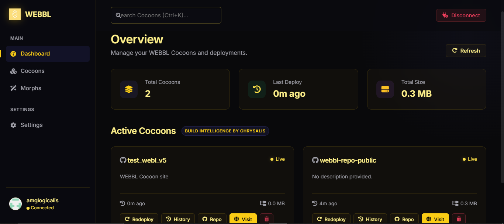

<p align="center">
  
</p>

<h1 align="center">WEBBL — Terra Ecosystem Hosting & CDN Engine</h1>

<p align="center">
  <strong>Infraestructura de Despliegue de Sitios Estáticos, SPAs y Serverless Morphs basada 100% en GitHub a Coste $0</strong>
</p>

<p align="center">
  <a href="#-visión-y-filosofía">Visión</a> •
  <a href="#-los-3-pilares-de-webbl">Los 3 Pilares</a> •
  <a href="#-instalación-y-cli">CLI & Uso</a> •
  <a href="#-consola-web">Consola Web</a> •
  <a href="#-integración-con-el-ecosistema-terra">Ecosistema Terra</a> •
  <a href="#-licencia">Licencia MIT</a>
</p>

---

## 🌐 Visión y Filosofía

**WEBBL** es el titán de despliegue frontend y CDN global del **Ecosistema Terra**. Proporciona una alternativa autónoma, gratuita y de código abierto a plataformas de hosting tradicionales como Vercel o Netlify.

Su premisa inquebrantable es: **Coste económico de infraestructura cero ($0) y libertad total del desarrollador**.

Aprovecha el **GitHub Engine** para compilar, alojar y distribuir sitios web, Single Page Applications (SPAs) y funciones serverless efímeras directamente desde tus repositorios de GitHub.

---

## 🔒 Visibilidad de Repositorios (Públicos por Defecto & Ajuste Privado)

> [!IMPORTANT]
> **Privacidad por defecto**: Todos los repositorios que se crean automáticamente al desplegar una nueva **Cocoon** o crear una **Morph Function** se inicializan como **Repositorios Públicos** por defecto para garantizar compatibilidad directa con GitHub Pages a **coste $0**.

### 🛡️ ¿Cómo cambiar la visibilidad de tu repositorio a Privado?
Si deseas que el código fuente de tu Cocoon o Morph sea **Privado**, puedes cambiar la visibilidad en **1 clic** en cualquier momento:

1. Ve a tu cuenta de GitHub y abre el repositorio creado (ej. `tu-usuario/mi-cocoon-app` o `tu-usuario/mi-morph-fn`).
2. Entra en la pestaña **Settings** (Configuración del repositorio).
3. Desplázate hasta el final a la sección **Danger Zone** (Zona de peligro).
4. En **Change repository visibility** (Cambiar visibilidad), haz clic en **Change visibility** y selecciona **Make private**.
5. Confirma la acción escribiendo el nombre de tu repositorio.

---

## 🏛️ Los 3 Pilares de WEBBL

WEBBL está diseñado en torno a 3 conceptos fundamentales:

```
WEBBL
├── 🐛 Cocoons     → Deploy de sitios estáticos & SPAs sobre GitHub Pages.
│                    Preview por rama/PR. Rollback instantáneo. Custom domains.
│
├── 🦋 Morphs      → Serverless Functions en 3 modalidades:
│                    • Async Morphs (~30s, formularios y webhooks)
│                    • Build Morphs (0ms, ejecutados durante la compilación)
│                    • Hatch Morphs (Live Workers efímeros de larga duración en Node.js)
│
└── 🫧 Chrysalis   → Inteligencia de compilación. Detección automática de 14+ frameworks,
                     Lighthouse scores, optimización de assets y build incremental.
```

### 1. 🐛 Cocoons (Static Hosting & CDNs)
- Despliegue automático de proyectos compilados (Vite, React, Next.js estático, Astro, SvelteKit, etc.) hacia la rama `gh-pages`.
- Soporte para vista previa en ramas (`preview deployments`).
- Historial de versiones y **rollback instantáneo** utilizando GitHub Releases en tu propio repositorio sin depender de servicios de terceros.

### 2. 🦋 Morphs (Serverless Functions)
- **Runtime Async Morphs**: Manejo asíncrono de formularios y webhooks mediante eventos dispatch.
- **Build Morphs**: Inyección de datos de APIs externas durante el tiempo de build (0ms de latencia en cliente).
- **Hatch Morphs**: Ejecución de microservicios efímeros Node.js completos (con hasta 7GB de RAM y CPU completa) bajo demanda sobre GitHub Actions runners.

### 3. 🫧 Chrysalis (Build Intelligence)
- Autodetección nativa de más de 14 frameworks populares: **Vite, React, Next.js, Astro, Nuxt, Gatsby, Docusaurus, VitePress, SvelteKit, Eleventy, Hugo, Jekyll, Plain HTML**.
- Ejecución limpia de comandos de compilación y empaquetado de assets.

---

## 🛠️ Instalación y Uso de CLI

### Instalación Global o Ejecución con `npx`

```bash
npm install -g terra-webbl
# o directamente:
npx terra-webbl <comando>
```

### 🚀 Comandos Principales

#### 1. Inicializar un Proyecto
```bash
npx webbl init
```
Detecta automáticamente el framework usado por Chrysalis y crea el archivo de configuración `webbl.config.json`.

#### 2. Desplegar un Cocoon
```bash
npx webbl deploy
```
Compila y publica el sitio actual. Puedes incluir notas de versión:
```bash
npx webbl deploy -m "Actualización del layout principal"
```

#### 3. Autodetectar Framework
```bash
npx webbl detect
```

#### 4. Listar Sitios Desplegados (Cocoons)
```bash
npx webbl ls
```

#### 5. Renombrar un Cocoon o Morph
Renombrar el repositorio de una Cocoon en GitHub:
```bash
npx webbl rename usuario/viejo-nombre nuevo-nombre
```
Renombrar el repositorio de un Morph Serverless en GitHub:
```bash
npx webbl morph rename usuario/viejo-morph nuevo-morph
```

#### 6. Historial de Despliegues, Rollback y Gestión de Versiones
Ver historial de versiones:
```bash
npx webbl history usuario/mi-proyecto
```

Restaurar una versión previa (ejecuta un Rollback inmutable re-apuntando la rama `gh-pages` y creando una release de respaldo `v1.0.0-rb-1`):
```bash
npx webbl rollback usuario/mi-proyecto webbl-v1722288000000
```

Renombrar la etiqueta de una versión en el historial:
```bash
npx webbl release rename usuario/mi-proyecto v1.0.0 v1.0.0-prod
```

Eliminar una versión específica del historial:
```bash
npx webbl release delete usuario/mi-proyecto v1.0.0
```

#### 7. Eliminar un Cocoon o Morph
Eliminar el despliegue web (`gh-pages`):
```bash
npx webbl delete usuario/mi-proyecto
```

Eliminar el repositorio completo de GitHub permanentemente:
```bash
npx webbl delete usuario/mi-proyecto --repo
```

Eliminar una Serverless Morph:
```bash
npx webbl morph delete usuario/mi-morph
```

#### 8. Abrir en Navegador
```bash
npx webbl open
```

---

## 🎛️ Consola Web (UI Dashboard)

Accede a la Consola Web desplegada 24/7 desde cualquier navegador o dispositivo móvil:

👉 **[https://amglogicalis.github.io/webbl-repo-public/](https://amglogicalis.github.io/webbl-repo-public/)**

<div align="center" style="margin: 1.5rem 0;">
  
</div>

WEBBL incluye una interfaz web nativa basada en la estética **Dark Glassmorphism** para gestionar todos tus despliegues visualmente sin depender de la terminal.

También puedes iniciar la consola localmente en tu equipo:
```bash
npx webbl console
```

Abre automáticamente `http://localhost:3721` con un dashboard moderno:
- **🐛 Cocoons Directory**: Visualización, renombramiento y gestión de todas tus aplicaciones web desplegadas.
- **🦋 Morphs Directory**: Creación, renombramiento, listado y ejecución en tiempo real de funciones Serverless (**Async**, **Build** y **Hatch** Morphs).
- **Deploy & Redeploy**: Arrastra o selecciona archivos estáticos (`.html`, `.css`, `.js`, etc.) con pre-visualización y descarte de archivos.
- **Version Tags Personalizadas**: Elige la etiqueta de versión (ej. `v1.0.0`, `v2-beta`) o deja que se autogenere.
- **Historial e Indicador Activo Real (`Active`)**: Identifica con precisión la versión que está en vivo en ese instante comparando el commit SHA.
- **Renombrado y Borrado de Versiones Modal**: Cambia etiquetas o elimina Releases del historial mediante modales Dark Glass.
- **Rollbacks con Estado de Progreso en Vivo**: Confirmaciones en tiempo real de compilaciones.
- **Eliminación Permanente de Repositorios**: Borra repositorios completos directamente desde la web con confirmación de seguridad.

---

## ❓ Troubleshooting & Preguntas Frecuentes (FAQ)

### ⚠️ 1. El estado en la Consola Web aparece como "Live" (🟢) o "Building" (🟡) pero los cambios aún no se ven en la web pública. ¿Qué ocurre?

**Explicación**:
El indicador visual en la Consola Web consulta el estado reportado por la API de GitHub Pages (`GET /repos/{owner}/{repo}/pages`). Sin embargo, en ocasiones (aproximadamente 1 de cada 7 despliegues), los servidores de GitHub tardan unos segundos adicionales en sincronizar el estado global o propagar la caché de la CDN.

**Recomendación**:
Ten paciencia. El indicador de la Consola Web es una **guía visual orientativa**. 
El **verdadero progreso en tiempo real y la fuente absoluta de verdad** es hacer clic en el botón **`Repo`** (o ingresar a tu repositorio en GitHub) y revisar la pestaña **Actions** sobre la rama `gh-pages`. Allí verás la ejecución exacta paso a paso del runner de GitHub.

### ❓ 2. El comando `deploy` o la Consola Web me devuelve `404 Not Found` o `Branch gh-pages not found`.

- Asegúrate de que tu GitHub Personal Access Token (PAT) tenga los permisos (scopes) mínimos necesarios:
  - `repo` (Full control of private and public repositories)
  - `workflow` (Update GitHub Action workflows)
  - `delete_repo` (Si deseas eliminar repositorios enteros)
- WEBBL crea automáticamente la rama `gh-pages` y configura el motor estático en `build_type: "legacy"`. Si el repositorio es nuevo, espera 2 o 3 segundos para que la API de GitHub termine de registrar el commit inicial.

### ❓ 3. ¿Por qué al hacer Rollback se crea una Release con el nombre `v1.0.0-rb-1`?

Al hacer un Rollback a una versión antigua (ejemplo `v1.0.0`), WEBBL crea una nueva Release de respaldo etiquetada como `v1.0.0-rb-1` para dejar un **registro inmutable de auditoría**. Esto garantiza que nunca pierdas el historial de despliegues y puedas auditar en qué momento exacto se realizó cada restauración.

---

## 💻 SDK para Node.js / TypeScript (`terra-webbl`)

También puedes controlar WEBBL de forma programática en tus scripts o herramientas:

```typescript
import { Webbl } from 'terra-webbl';

const webbl = new Webbl({
  githubToken: process.env.GITHUB_TOKEN!
});

// Desplegar un Cocoon
const result = await webbl.deploy({
  repo: 'mi-usuario/mi-sitio',
  message: 'Deploy programático'
});

// Renombrar un Cocoon
await webbl.renameCocoon('mi-usuario/mi-sitio', 'mi-nuevo-sitio');

// Renombrar un Morph
await webbl.renameMorph('mi-usuario/mi-morph', 'mi-nuevo-morph');

// Rollback a una versión previa
await webbl.rollback('mi-usuario/mi-sitio', 'v1.0.0');

// Renombrar una release
await webbl.renameRelease('mi-usuario/mi-sitio', 'webbl-v1785370361934', 'v1.0.0');

console.log(`Sitio en vivo en: ${result.url}`);
```

---

## 🔗 Integración con el Ecosistema Terra

WEBBL opera de forma totalmente autosuficiente, pero se integra sinérgicamente con otros titanes del ecosistema:

- **🔐 Lumina**: Autenticación para paneles de control web.
- **🛡️ Synchlor**: Almacenamiento seguro de secretos y tokens.
- **⏰ Syncada**: Despliegues automáticos programados (Rebuilds diarios).
- **🐜 Formica**: Emisión de eventos al completar despliegues.
- **🎭 Ballom**: Enrutamiento DNS y dominios personalizados.

---

## 📜 Licencia

Distribuido bajo la **Licencia MIT**. Consulta [`LICENSE`](LICENSE) para más información.

<p align="center">
  <sub>Desarrollado bajo la filosofía Terra • Nube Serverless a Coste $0</sub>
</p>
